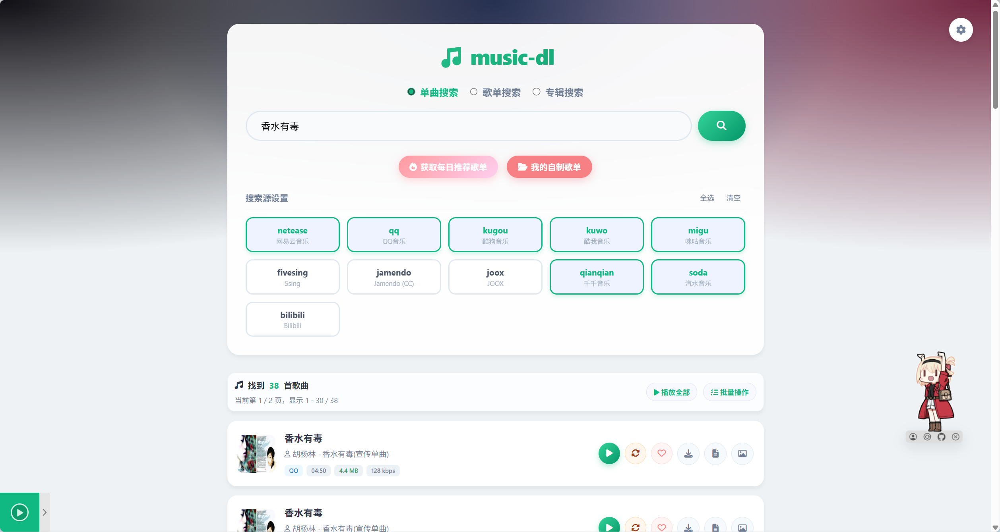
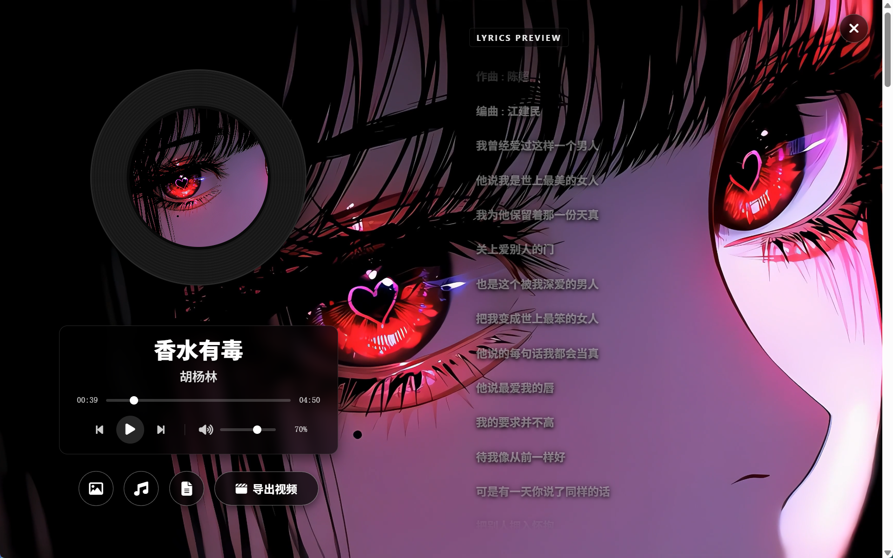

# Go Music DL

Go Music DL 是一个音乐搜索与下载工具，支持 **Web 界面**、**TUI 终端** 和 **桌面应用** 三种使用模式。你可以在浏览器试听，也可以在终端里批量下载，或使用原生桌面应用享受最佳体验。

## 🚀 快速开始

### 桌面应用 (推荐)

最简单的使用方式，下载即用：

1. 从 [Releases](https://github.com/guohuiyuan/go-music-dl/releases) 下载 `music-dl-desktop.exe`
2. 解压，双击运行
3. 享受原生桌面体验！

### Web 模式

```bash
./music-dl web

```

### TUI 模式

```bash
./music-dl -k "搜索关键词"

```

---





## 主要功能

* **多模式支持**: Web 界面、TUI 终端、桌面应用
* **本地自制歌单**: 支持新建本地收藏夹，随时收藏、管理心仪歌曲，数据持久化不丢失
* **无损音乐支持**: 支持网易云、QQ 音乐、Bilibili 的 FLAC 无损音乐下载
* 多平台聚合搜索与歌单搜索
* 试听、歌词、封面下载
* Range 探测：显示大小与码率
* 汽水音乐等加密音频解密
* 过滤需要付费的资源
* **桌面应用特性**: 原生窗口、自动服务启动、智能缓存管理

## 新增改动（简要）

* **Web 架构全面重构**：前端代码彻底模块化（拆分独立的 JS / CSS / HTML 模板），后端路由按业务域拆分（音乐查询、歌单管理、视频生成），大幅提升代码可维护性。
* **新增自制歌单功能**：Web 端支持本地收藏夹，用户可自由创建、编辑歌单，将不同平台的歌曲聚合收藏。
* Web 试听按钮支持播放/停止切换，底部增加全局播放与音量控制栏。
* Web 单曲支持“换源”，按相似度优先、时长接近、可播放验证。
* 换源自动排除 soda 与 fivesing。
* TUI 增加 r 键批量换源，并显示换源进度。
* 增加“每日歌单推荐”，Web 和 TUI 都能看。
* Web 端支持批量操作：全选、选择无效、批量下载、批量换源。

## 快速开始

### 桌面应用模式

桌面应用提供了原生窗口体验，无需打开浏览器即可使用。

#### 特性

* 🖥️ 原生桌面窗口，无需浏览器
* 🚀 自动启动内置Web服务器
* 🎵 完整Web界面功能
* 📦 单文件分发，绿色免安装
* 🖼️ 自定义窗口图标
* 🔒 使用罕见端口(37777)，避免端口冲突

### Docker 部署 (零配置)

本项目提供了多种 Docker 部署方式，已全面升级为 **Docker 命名卷 (Named Volumes)** 管理数据，彻底告别权限报错和手动建文件夹的烦恼，实现真正的零配置一键启动。

#### 1. 生产环境部署（推荐）

项目包含 `docker-compose.yml` 文件，直接拉取云端预编译镜像，无需在本地构建：

```bash
# 后台启动服务
docker compose up -d

# 查看日志
docker compose logs -f

# 停止服务
docker compose down

```

浏览器访问 `http://localhost:8080`。

**说明：**

* 自动拉取 `guohuiyuan/go-music-dl:latest` 镜像
* 支持后台运行和自动重启
* **真·零配置**：自动创建 Docker 命名卷来持久化 `downloads` (下载目录)、`cookies.json` (配置) 和 `favorites.db` (收藏夹数据)，无需手动干预
* 设置时区为亚洲上海
* 以非root用户(uid=1000)运行，提高安全性

#### 2. 开发环境部署（本地构建）

如果您修改了源码，希望在本地通过 Docker 重新构建并测试效果，请使用 `docker-compose.dev.yml`：

```bash
# 强制在本地使用 Dockerfile 进行构建并启动
docker compose -f docker-compose.dev.yml up -d --build

```

#### 3. 纯命令行模式 (docker run)

如果不使用 Compose，也可以直接通过命令行运行（同样使用命名卷保证零配置和数据持久化）：

```bash
docker run -d --name music-dl \
  -p 8080:8080 \
  -v music_data_downloads:/home/appuser/downloads \
  -v music_data_cookies:/home/appuser/cookies.json \
  -v music_data_favorites:/home/appuser/favorites.db \
  -e TZ=Asia/Shanghai \
  --user 1000:1000 \
  --restart unless-stopped \
  guohuiyuan/go-music-dl:latest

```

*提示：使用命名卷后，下载的歌曲文件保存在 Docker 的虚拟卷中。如果需要导出音乐文件，可以通过网页端的“批量下载”功能直接保存到本地。*

### CLI/TUI 模式

```bash
# 搜索
./music-dl -k "周杰伦"

```

TUI 常用按键：

* `↑/↓` 移动
* `空格` 选择
* `a` 全选/清空
* `r` 对勾选项换源
* `Enter` 下载
* `b` 返回
* `w` 每日推荐歌单
* `q` 退出

更多用法：

```bash
# 查看帮助
./music-dl -h

# 指定搜索源
./music-dl -k "周杰伦 晴天" -s qq,netease

# 指定下载目录
./music-dl -k "周杰伦" -o ./my_music

# 下载时包含封面和歌词
./music-dl -k "周杰伦" --cover --lyrics

```

## GitHub Actions 自动构建

本项目已配置 GitHub Actions 工作流。当推送代码并打上版本标签（如 `v1.0.0`）时，会自动触发 `.github/workflows/docker.yml`，构建跨平台镜像（支持 amd64 和 arm64）并推送到 DockerHub。

**如果你 Fork 了本仓库并希望使用自己的构建流：**

1. 在你的仓库 **Settings** -> **Secrets and variables** -> **Actions** 中添加：

* `DOCKERHUB_USERNAME`: 你的 DockerHub 用户名
* `DOCKERHUB_TOKEN`: 你的 DockerHub 访问令牌

2. 将 `docker-compose.yml` 中的镜像地址修改为你自己的：`image: 你的用户名/go-music-dl:latest`

## Web 换源说明

单曲卡片里的“换源”会在其它平台里找更像的版本：

* 先看歌名/歌手相似度
* 再看时长差异（太大就跳过）
* 最后做可播放探测

当前会跳过 soda 与 fivesing。

## 每日歌单推荐

Web 页面有“每日推荐”入口，会聚合网易云、QQ、酷狗、酷我。
TUI 在输入界面按 `w` 直接拉取推荐歌单，然后回车进详情。

## 支持平台

| 平台 | 包名 | 搜索 | 下载 | 歌词 | 歌曲解析 | 歌单搜索 | 歌单推荐 | 歌单歌曲 | 歌单链接解析 | 备注 |
| --- | --- | --- | --- | --- | --- | --- | --- | --- | --- | --- |
| 网易云音乐 | `netease` | ✅ | ✅ | ✅ | ✅ | ✅ | ✅ | ✅ | ✅ | 支持 FLAC 无损 |
| QQ 音乐 | `qq` | ✅ | ✅ | ✅ | ✅ | ✅ | ✅ | ✅ | ✅ | 支持 FLAC 无损 |
| 酷狗音乐 | `kugou` | ✅ | ✅ | ✅ | ✅ | ✅ | ✅ | ✅ | ✅ |  |
| 酷我音乐 | `kuwo` | ✅ | ✅ | ✅ | ✅ | ✅ | ✅ | ✅ | ✅ |  |
| 咪咕音乐 | `migu` | ✅ | ✅ | ✅ | ❌ | ✅ | ❌ | ❌ | ❌ |  |
| 千千音乐 | `qianqian` | ✅ | ✅ | ✅ | ❌ | ❌ | ❌ | ✅ | ❌ |  |
| 汽水音乐 | `soda` | ✅ | ✅ | ✅ | ✅ | ✅ | ❌ | ✅ | ✅ | 音频解密 |
| 5sing | `fivesing` | ✅ | ✅ | ✅ | ✅ | ✅ | ❌ | ✅ | ✅ |  |
| Jamendo | `jamendo` | ✅ | ✅ | ❌ | ✅ | ❌ | ❌ | ❌ | ❌ |  |
| JOOX | `joox` | ✅ | ✅ | ✅ | ❌ | ✅ | ❌ | ❌ | ❌ |  |
| Bilibili | `bilibili` | ✅ | ✅ | ❌ | ✅ | ✅ | ❌ | ✅ | ✅ | 支持 FLAC 无损 |

## 歌曲链接解析

支持直接解析音乐分享链接：

```bash
./music-dl -k "[https://music.163.com/#/song?id=123456](https://music.163.com/#/song?id=123456)"

```

支持解析的平台：网易云、QQ音乐、酷狗、酷我、咪咕、Bilibili、汽水音乐、5sing、Jamendo。

## 歌单链接解析

支持直接解析歌单/合集分享链接：

```bash
./music-dl -k "[https://music.163.com/#/playlist?id=123456](https://music.163.com/#/playlist?id=123456)"

```

支持解析的平台：网易云、QQ音乐、酷狗、酷我、汽水音乐、5sing、Bilibili。

## 常见问题

### 桌面应用相关

**Q: 桌面应用打不开或显示空白？**
检查是否已安装 WebView2 运行时。从 [Microsoft官网](https://developer.microsoft.com/microsoft-edge/webview2/) 下载安装最新版本。

**Q: 桌面应用启动慢或卡顿？**
首次运行需要下载 WebView2 运行时。也可提前安装 Evergreen Bootstrapper 版本。

**Q: 桌面应用启动时提示"另一个程序正在使用此文件"？**
这是因为上一次运行的后台进程没有正常退出。解决方案：

```powershell
# 强制结束残留进程
taskkill /F /IM music-dl.exe

```

**Q: 如何构建桌面应用？**

```bash
# 1. 构建 Go 二进制
go build -o desktop/music-dl.exe cmd/music-dl/main.go

# 2. 构建 Rust 桌面应用
cd desktop
cargo build --release

```

**Q: 桌面应用支持哪些平台？**
目前支持 Windows (x64/x86/arm64)、macOS (x64/arm64)、Linux (x64)。

### 通用问题

**Q: 有些歌搜不到或下载失败？**
可能是付费限制、平台接口变更或网络问题。

**Q: Web 模式打不开？**
检查端口是否占用，或浏览器插件是否拦截。

**Q: 如何设置 Cookie 获取更高音质？**
Web 右上角“设置”里可添加平台 Cookie。


## 项目结构

```text
go-music-dl/
├── cmd/
│   └── music-dl/          # CLI/TUI 主程序
├── core/                  # 核心业务逻辑
├── internal/
│   ├── cli/               # TUI 界面 (如: ui.go)
│   └── web/               # 重构后的 Web 后端服务
│       ├── templates/     # 前端模板与静态资源分离
│       ├── server.go      # Web 服务主入口
│       ├── music.go       # 音乐搜索与解析路由
│       ├── collection.go  # 本地自制歌单接口 (GORM)
│       └── videogen.go    # 视频生成后端支持
├── desktop/               # 桌面应用 (Rust + Tao/Wry)
├── data/                  # 🌟 统一数据持久化目录 (Docker挂载点)
│   ├── downloads/         # 下载的音乐文件
│   ├── video_output/      # 生成的视频文件
│   ├── cookies.json       # Cookie 配置文件
│   └── favorites.db       # 自制歌单 SQLite 数据库
├── .github/workflows/     # GitHub Actions 工作流
├── screenshots/           # 截图资源
├── docker-compose.yml     # Docker 生产环境配置 (直接拉取镜像)
├── docker-compose.dev.yml # Docker 开发环境配置 (本地构建)
├── Dockerfile             # Docker 构建配置
├── go.mod                 # Go 模块配置
└── README.md              # 主项目说明

```

## 技术栈

* **核心库**: [music-lib](https://github.com/guohuiyuan/music-lib) - 音乐平台搜索下载
* **CLI 框架**: [Cobra](https://github.com/spf13/cobra) - 命令行工具
* **Web 框架**: [Gin](https://github.com/gin-gonic/gin) - Web 框架
* **TUI 框架**: [Bubble Tea](https://github.com/charmbracelet/bubbletea) - 终端界面
* **桌面框架**: [Tao](https://github.com/tauri-apps/tao) + [Wry](https://github.com/tauri-apps/wry) - 跨平台桌面应用
* **图像处理**: [image](https://github.com/image-rs/image) - 图标处理
* **下载库**: [music-dl](https://github.com/0xHJK/music-dl) - 音乐下载库
* **下载库**: [musicdl](https://github.com/CharlesPikachu/musicdl) - 音乐下载库
* **无损音乐**: [Suxiaoqinx/Netease_url](https://github.com/Suxiaoqinx/Netease_url) - 网易云音乐 FLAC 无损音乐解析
* **QQ 音乐**: [Suxiaoqinx/qqmusic_flac](https://github.com/Suxiaoqinx/qqmusic_flac) - QQ 音乐 FLAC 解析

### 桌面应用架构

桌面应用采用前后端分离架构：

* **前端**: Rust + Tao/Wry - 负责窗口管理、WebView 渲染和进程管理
* **后端**: Go 二进制 - 嵌入到桌面应用中，提供 Web 服务和音乐功能
* **通信**: HTTP 本地服务 - 前后端通过 `http://localhost:37777` 通信

详细说明请参考 [desktop/README.md](desktop/README.md)

## 贡献

欢迎提交 Issue 或 Pull Request。

## 许可证

本项目遵循 GNU Affero General Public License v3.0（AGPL-3.0）。详情见 [LICENSE](LICENSE)。

## 免责声明

仅供学习和技术交流使用。下载的音乐资源请在 24 小时内删除。